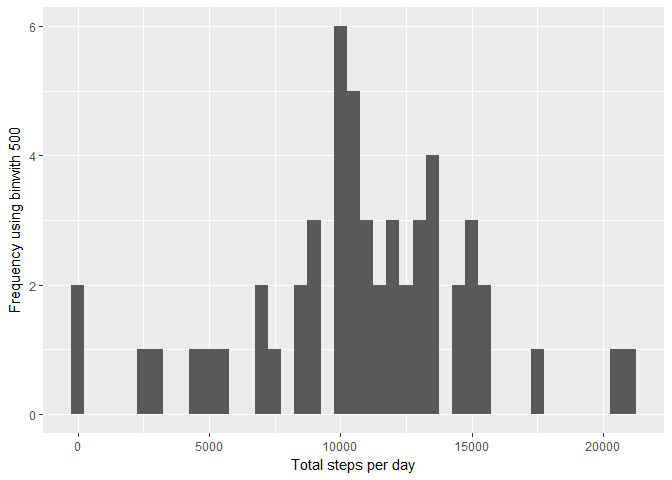
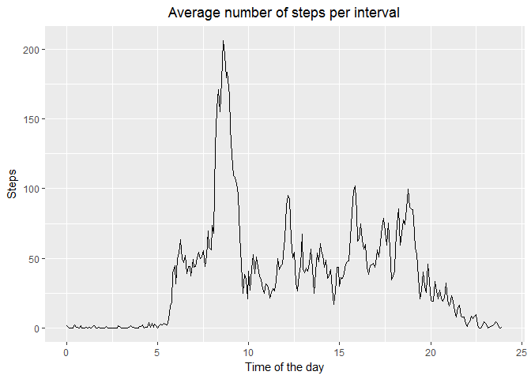
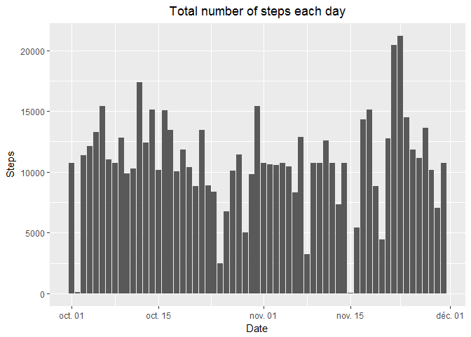
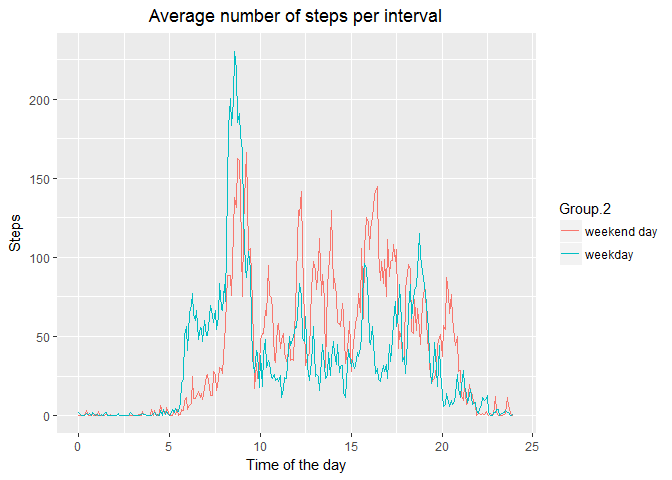

# Reproducible Research: Peer Assessment 1
###1. Code for reading in the dataset and/or processing the data

```r
url<- "https://d396qusza40orc.cloudfront.net/repdata%2Fdata%2Factivity.zip"
download.file(url,"activity.zip")
unzip("activity.zip","activity.csv")
file.remove("activity.zip")
```

```
## [1] TRUE
```

```r
data<-read.csv("activity.csv")
file.remove("activity.csv")
```

```
## [1] TRUE
```

###2. Histogram of the total number of steps taken each day

```r
require(ggplot2)
```

```
## Loading required package: ggplot2
```

```r
hist_data<- na.omit(data)
n_steps_day<-aggregate(hist_data[,1],by=list(hist_data$date), FUN=sum)
g<-ggplot(n_steps_day, aes(x=as.Date(Group.1), y=x)) + geom_bar(stat="identity")+labs(title="Total number of steps each day",y="Steps",x="Date")+theme(plot.title = element_text(hjust = 0.5))
print(g)
```

<!-- -->

###3. Mean and median number of steps taken each day


```r
mean(n_steps_day[,2])
```

```
## [1] 10766.19
```

```r
median(n_steps_day[,2])
```

```
## [1] 10765
```

###4. Time series plot of the average number of steps taken

```r
plot_data<-data
plot_data$interval <- paste(formatC(trunc(plot_data$interval/100),width=2,format="d",flag="0"),":",formatC(round((plot_data$interval/100-trunc(plot_data$interval/100))*100),width=2,format="d",flag="0"),sep="")
plot_data$interval<-as.factor(plot_data$interval)
mean_steps_interval<-aggregate(plot_data[,1],by=list(plot_data$interval), FUN=mean,na.rm=TRUE)
mean_steps_interval$Group.1<-paste(Sys.Date(),mean_steps_interval$Group.1,sep=" ")
mean_steps_interval$Group.1<-strptime(mean_steps_interval$Group.1,format="%Y-%m-%d %H:%M")
mean_steps_interval$Group.1<-as.POSIXct(mean_steps_interval$Group.1)
mean_steps_interval$Group.2<-round(as.numeric(mean_steps_interval$Group.1-trunc(mean_steps_interval$Group.1,"days"))/3600,digits=2)

g<-ggplot(mean_steps_interval, aes(x=Group.2, y=x))+geom_line()+labs(title="Average number of steps per interval",y="Steps",x="Time of the day")+theme(plot.title = element_text(hjust = 0.5))+xlim(0,24)
print(g)
```

<!-- -->

###5. The 5-minute interval that, on average, contains the maximum number of steps

```r
strftime(mean_steps_interval[which.max(mean_steps_interval$x),1],format="%H:%M")
```

```
## [1] "08:35"
```

###6. Code to describe and show a strategy for imputing missing data
For every missing value we will put the average number of steps per interval.
Missing values : 2304


```r
mean_steps_interval$Group.1<-as.factor(strftime(mean_steps_interval[,1],format="%H:%M"))
data_after_impute<-plot_data
for ( i in 1:length(mean_steps_interval$Group.1)) { 
data_after_impute[which(is.na(data_after_impute$steps) & data_after_impute$interval == mean_steps_interval[i,1]),1]<-mean_steps_interval[i,2]
}
missingValue<-sum(is.na(data_after_impute$steps))
```
Missing values after allocation: 0

###7. Histogram of the total number of steps taken each day after missing values are imputed

```r
hist_data<- data_after_impute
n_steps_day2<-aggregate(hist_data[,1],by=list(hist_data$date), FUN=sum)
g<-ggplot(n_steps_day2, aes(x=as.Date(Group.1), y=x)) + geom_bar(stat="identity")+labs(title="Total number of steps each day",y="Steps",x="Date")+theme(plot.title = element_text(hjust = 0.5))
print(g)
```

<!-- -->

###8. Panel plot comparing the average number of steps taken per 5-minute interval across weekdays and weekends

```r
plot_data<-data_after_impute
plot_data$days<-weekdays(as.Date(plot_data$date))
plot_data$days<-1*(plot_data$days%in%c("lundi","mardi","mercredi","jeudi","vendredi"))
plot_data$days<-as.factor(plot_data$days)
levels(plot_data$days)<-c("weekend day","weekday")
mean_steps_interval_comparison<-aggregate(plot_data[,1],by=list(plot_data$interval,plot_data$days), FUN=mean,na.rm=TRUE)
mean_steps_interval_comparison$Group.1<-paste(Sys.Date(),mean_steps_interval_comparison$Group.1,sep=" ")
mean_steps_interval_comparison$Group.1<-strptime(mean_steps_interval_comparison$Group.1,format="%Y-%m-%d %H:%M")
mean_steps_interval_comparison$Group.1<-as.POSIXct(mean_steps_interval_comparison$Group.1)
mean_steps_interval_comparison$Group.3<-round(as.numeric(mean_steps_interval_comparison$Group.1-trunc(mean_steps_interval_comparison$Group.1,"days"))/3600,digits=2)

g<-ggplot(mean_steps_interval_comparison, aes(x=Group.3, y=x,color=Group.2))+geom_line()+labs(title="Average number of steps per interval",y="Steps",x="Time of the day")+theme(plot.title = element_text(hjust = 0.5))+xlim(0,24)
print(g)
```

<!-- -->
